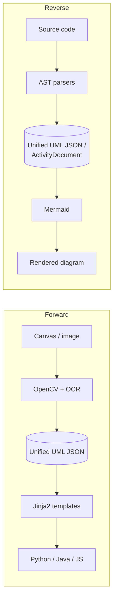
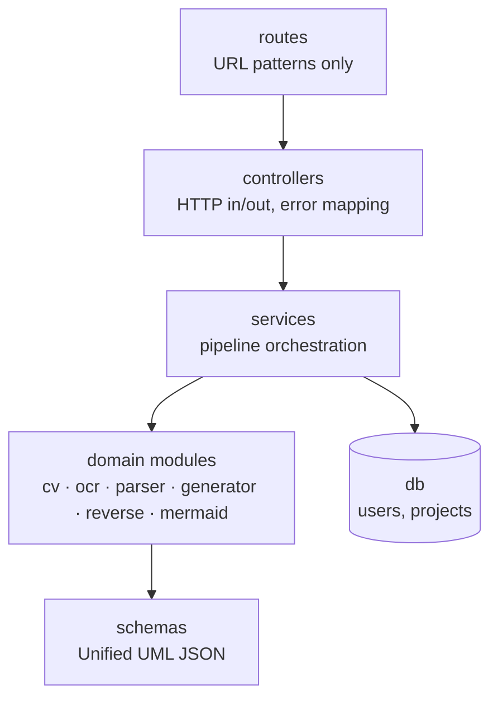

<p align="center">
  <!-- Replace assets/logo.svg with your logo (keep the filename, or update the path below) -->
  
</p>

<h1 align="center">UMLFrame</h1>

<p align="center">
  A bidirectional <b>UML ↔ Code</b> engineering platform.<br>
  Draw a class or activity diagram and get scaffold code, or point it at source code and get the diagram back.
</p>

<p align="center">
  
  
  
  
  
</p>

---

## Features

- **Visual editor** – infinite pan/zoom canvas with grid and snap, three-compartment class boxes, all five relationship types (plus realization), PNG export.
- **UML → Code** – generate scaffold code for **Python, Java and JavaScript**, one file per class.
- **Image → UML** – upload a diagram image (or the editor's own export) and rebuild it with OpenCV + OCR.
- **Code → UML** – reverse-engineer Python, Java or JavaScript into a class diagram, with inferred inheritance, composition, aggregation, association and dependency.
- **Activity diagrams, both ways** – activity image → structured `if`/`else`/`while` function, and source method → activity diagram (Mermaid or a re-importable PNG).
- **Mermaid preview** – render any diagram as a Mermaid `classDiagram` or `flowchart`.
- **Accounts & projects** – JWT auth, bcrypt passwords, per-user projects that save the canvas.
- **One contract** – every module speaks the validated *Unified UML JSON*, so each stage is independently testable.

## Screenshots

<table>
  <tr>
    <td><br><sub>Class diagram editor</sub></td>
    <td><br><sub>Generated code</sub></td>
  </tr>
  <tr>
    <td><br><sub>Code → UML</sub></td>
    <td><br><sub>Activity diagram editor</sub></td>
  </tr>
  <tr>
    <td><br><sub>Code → Activity</sub></td>
    <td><br><sub>Project dashboard</sub></td>
  </tr>
</table>

## Getting started

### Prerequisites

| Tool | Version | Notes |
|---|---|---|
| Python | 3.11+ | |
| Node.js | 20+ | for the frontend |
| Tesseract OCR | any recent | required by the image pipelines (`sudo apt install tesseract-ocr`, `brew install tesseract`) |

### 1. Clone

```bash
git clone https://github.com/nahian-misty/umlframe.git
cd umlframe
```

### 2. Backend (http://localhost:8000)

```bash
python3 -m venv .venv
source .venv/bin/activate            # Windows: .venv\Scripts\activate
pip install -e ".[dev]"

cp .env.example .env                 # defaults to a local SQLite file
uvicorn backend.main:app --reload --port 8000
```

Interactive API docs are served at <http://localhost:8000/docs>. Tables are created on startup.

### 3. Frontend (http://localhost:3000)

```bash
cd frontend
npm install
npm run dev
```

Open <http://localhost:3000>, register an account, create a project and start drawing.

### Configuration

Settings are read from `.env` at the repo root.

| Variable | Default | Purpose |
|---|---|---|
| `DATABASE_URL` | `mysql+pymysql://…` if unset; `.env.example` sets `sqlite:///./umlframe.db` | SQLAlchemy URL |
| `JWT_SECRET_KEY` | `dev-secret-change-me` | **Change this outside local development** |
| `CORS_ORIGINS` | `http://localhost:3000` | Comma-separated allowed origins |
| `ACCESS_TOKEN_EXPIRE_MINUTES` | `60` | Token lifetime |
| `VITE_API_BASE_URL` (frontend) | `http://localhost:8000` | Where the UI finds the API |

### Tests and checks

```bash
pytest                                # backend, from the repo root
ruff check backend/ && mypy backend/  # lint and types
cd frontend && npm run typecheck && npm run lint
```

## Architecture

Everything flows through a single intermediate representation, the **Unified UML JSON** (`UmlDocument`), with a sibling `ActivityDocument` for activity diagrams. Pipelines are one-directional and modules never call each other directly.



Backend layers, each with one job:



```
umlframe/
├── frontend/        React + TypeScript editor (canvas, activity canvas, dashboard)
├── backend/
│   ├── api/         routes, controllers, auth dependency
│   ├── services/    one service per pipeline use case
│   ├── schemas/     UmlDocument, ActivityDocument (Pydantic)
│   ├── cv/ ocr/ parser/        image → structured data
│   ├── generator/   language maps + Jinja2 templates
│   ├── reverse/     AST parsers (python, java, javascript)
│   ├── mermaid/     class + activity diagram text
│   └── db/          SQLAlchemy models and session
├── shared/schema/   canonical JSON Schema
├── tests/           mirrors backend/
└── wiki/            project wiki (see below)
```

## Wiki

Longer documentation lives in [`wiki/`](wiki/Home.md):

[Getting started](wiki/Getting-Started.md) · [Architecture](wiki/Architecture.md) · [Unified UML JSON](wiki/Unified-UML-JSON.md) · [API reference](wiki/API-Reference.md) · [Pipelines](wiki/Pipelines.md) · [UI guide](wiki/UI-Guide.md) · [Testing](wiki/Testing.md) · [Extending UMLFrame](wiki/Extending-UMLFrame.md) · [Limitations](wiki/Limitations.md)

## Notes

- Generated code is a **scaffold**: structure and signatures, never business logic. Activity-to-code reproduces the `if`/`while` shape only; every action and condition is a placeholder.
- Image pipelines are tuned for clean, programmatically rendered diagrams (including the editor's own export). See [Limitations](wiki/Limitations.md).

## Author

Sheikh Nahian (BSSE-1403), Institute of Information Technology, University of Dhaka. Supervised by Dr. Sumon Ahmed. Built as Software Project Lab III.
