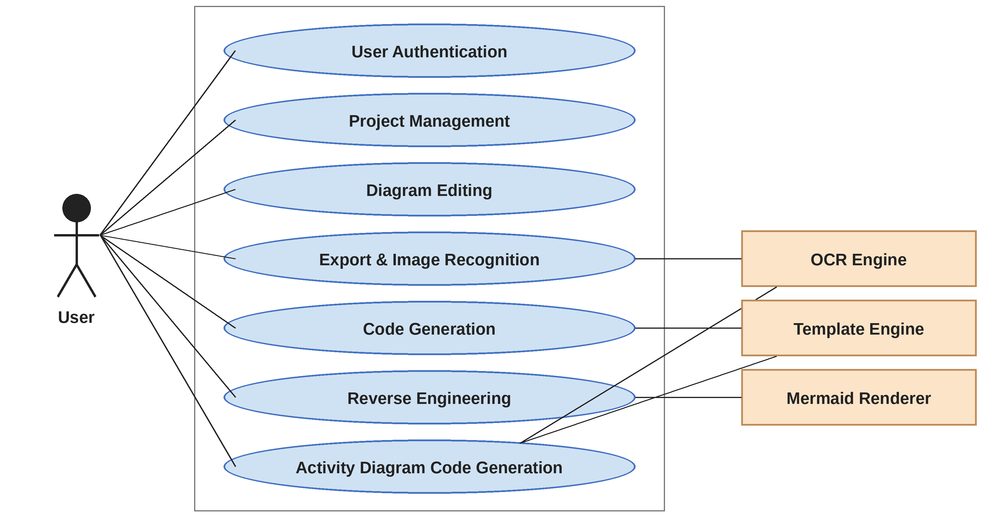
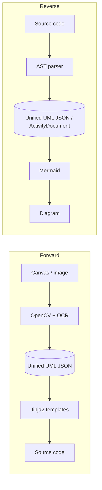
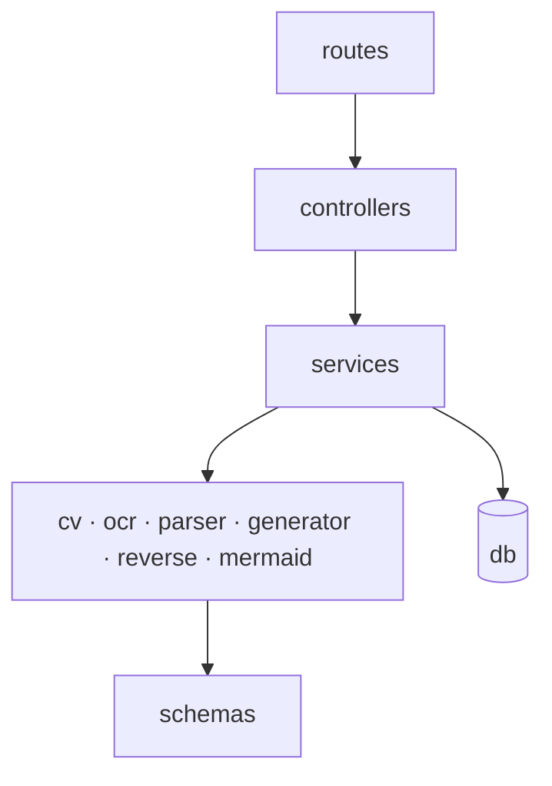

# Architecture

## Pipelines

Activity diagrams use a sibling schema, `ActivityDocument`. The class and activity tracks share concepts but no code path.

## Backend layers

| Layer | Responsibility |
|---|---|
| `api/routes` | URL patterns and HTTP methods only |
| `api/controllers` | Deserialize the request, call one service, map exceptions to HTTP errors |
| `api/dependencies` | Auth guard shared across routes |
| `models` | Pydantic models for the HTTP boundary (requests, responses) |
| `schemas` | `UmlDocument`, `ActivityDocument` and their validation |
| `services` | Orchestrate domain modules; own pipeline sequencing |
| `cv`, `ocr`, `parser` | Image to bounding boxes, to raw text, to structured data |
| `generator` | Language maps, registry and Jinja2 templates |
| `reverse` | One AST parser per language |
| `mermaid` | Class and activity diagram text |
| `db` | SQLAlchemy `User` and `Project`; only auth and project services touch it |

## Frontend

`frontend/src` holds the canvas (pan, zoom, grid, snap), the UML class box, a separate activity canvas, the dashboard and the four editor tabs. All canvas state flows through the `useDiagram` hook; the activity canvas uses `useActivityDiagram`. Routing uses `react-router-dom` with a `ProtectedRoute` guard.

## Design principles

1. The Unified UML JSON is the only contract between modules.
2. Pipelines are one-directional and share the schema, not code paths.
3. Extend by adding files (a language, a template), not by editing existing parsers or generators.
4. Every module is independently testable.
5. The backend is stateless per request; durable state lives only in `db/`.
6. The frontend serializes and the backend validates.
7. Generated code is a scaffold. Method bodies are stubs.

## Technology choices

| Area | Choice | Why |
|---|---|---|
| API | FastAPI + Pydantic v2 | Typed validation and structured 422s out of the box |
| Image | OpenCV, Tesseract, Pillow | Deterministic, local, testable, no training data |
| Reverse engineering | `ast`, `javalang`, `esprima` | Real parsers, so relationships are provable from the tree |
| Codegen | Jinja2 | Presentation-only templates; structure is resolved in Python |
| Persistence | SQLAlchemy, SQLite or MySQL | Swap databases through `DATABASE_URL` |
| Auth | bcrypt + JWT | Stateless per request |
| Frontend | React 19, TypeScript, Vite, Mermaid | Hooks for canvas state; Mermaid renders diagram text in the browser |
