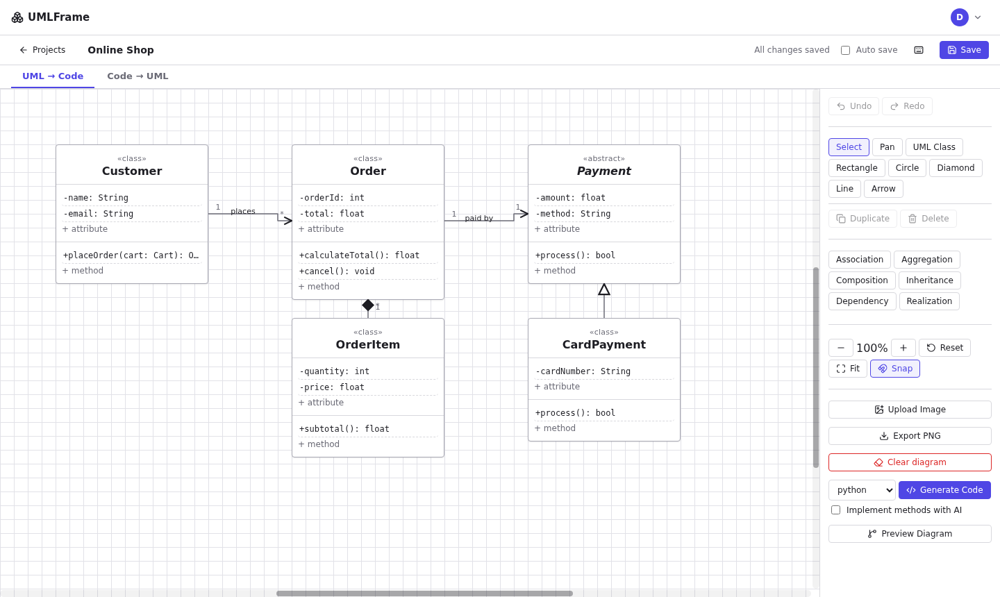

# UMLFrame Wiki

UMLFrame is a bidirectional **UML ↔ Code** engineering platform. Draw UML class or activity diagrams and generate scaffold code, or reverse-engineer source code back into diagrams.

| Page | What it covers |
|---|---|
| [Getting Started](Getting-Started.md) | Install, configure and run locally |
| [Architecture](Architecture.md) | Layers, module responsibilities, design principles |
| [Unified UML JSON](Unified-UML-JSON.md) | The schema every module shares |
| [API Reference](API-Reference.md) | All endpoints |
| [Pipelines](Pipelines.md) | Forward and reverse pipelines, state diagrams |
| [UI Guide](UI-Guide.md) | Using the editor and its tabs |
| [Testing](Testing.md) | Strategy, how to run, coverage targets |
| [Extending UMLFrame](Extending-UMLFrame.md) | Adding a language or endpoint |
| [Limitations](Limitations.md) | Known v1 scope limits |

**Key idea:** the Unified UML JSON is the only contract. No stage knows how another stage works internally, so each can be tested alone.
