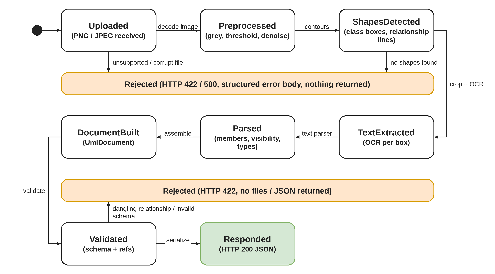
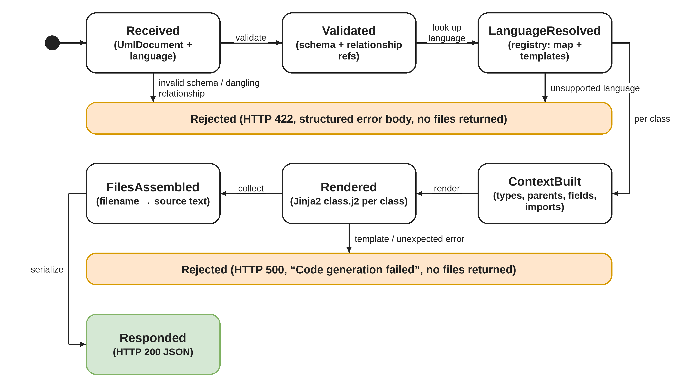
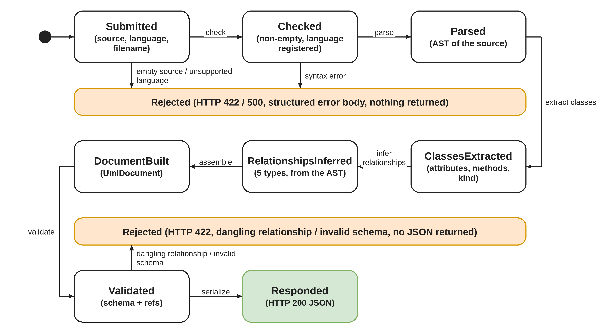
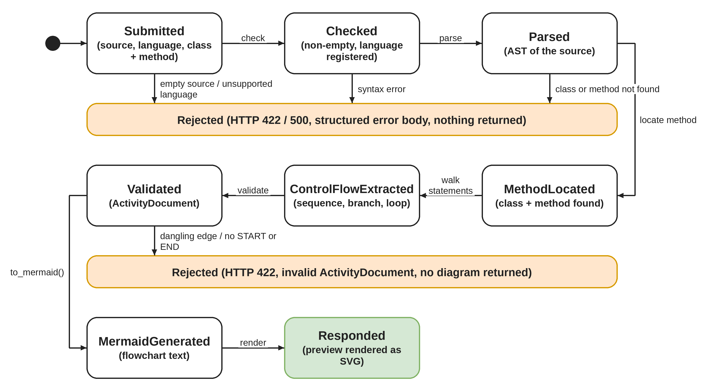
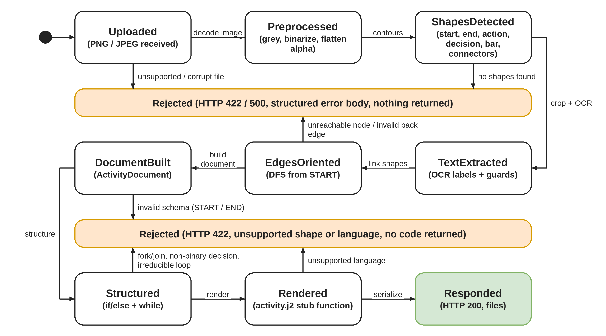

# Pipelines

Four pipelines, two per diagram type. Each request is stateless and ends in either a validated result or a structured rejection.

## UML image → JSON

CV finds class boxes from stacked horizontal rules, then groups the remaining ink into connectors. Each connector is classified by marker (hollow triangle, hollow or filled diamond, open arrow) and by dashed vs solid. OCR runs only inside detected boxes, and the text parser repairs common OCR slips.

## UML JSON → code

The generator resolves types, parents, fields and imports in Python, then renders one Jinja2 template per class. Aggregation and composition relationships also become typed fields on the "whole" class.

## Code → UML

| Evidence in the source | Relationship |
|---|---|
| `extends` / base class | inheritance |
| `implements` / interface base | realization (inheritance to an interface) |
| `self.x = Known()` / `new Known()` | composition |
| collection of a known class | aggregation |
| single held reference | association |
| parameter or return type that is not a field | dependency |

Inference is best-effort: only what can be proven from the tree is emitted.

## Code → Activity

`extract_control_flow` walks one method and reduces sequence, branches and loops to an `ActivityDocument` (a loop is a decision node with a back edge). Action text is phrased in plain English by `backend/reverse/phrasing.py`. The result can be shown as Mermaid or downloaded as a PNG that the Activity → Code pipeline can read back.

## Activity image → code

Edge direction comes from a DFS from the unique START node, disambiguated by drawn-line distance. A node unreachable from START or an invalid back edge is rejected. `activity_structuring.py` then rebuilds `if`/`else` and `while`. Fork/join, non-binary decisions and irreducible loops are rejected with a 422.

Generated bodies are placeholders: actions become `# TODO: <label>` / `pass`, decisions become `if True:`, and loops become `while False:` so generated code never loops forever by default.
