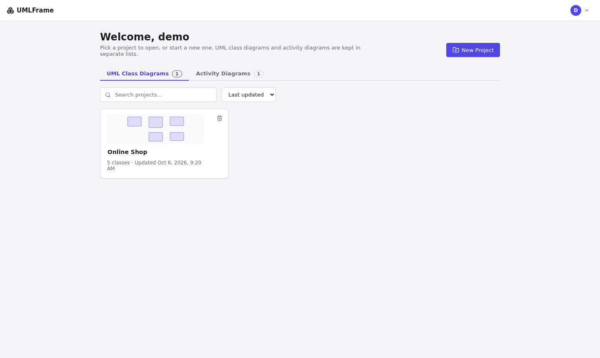
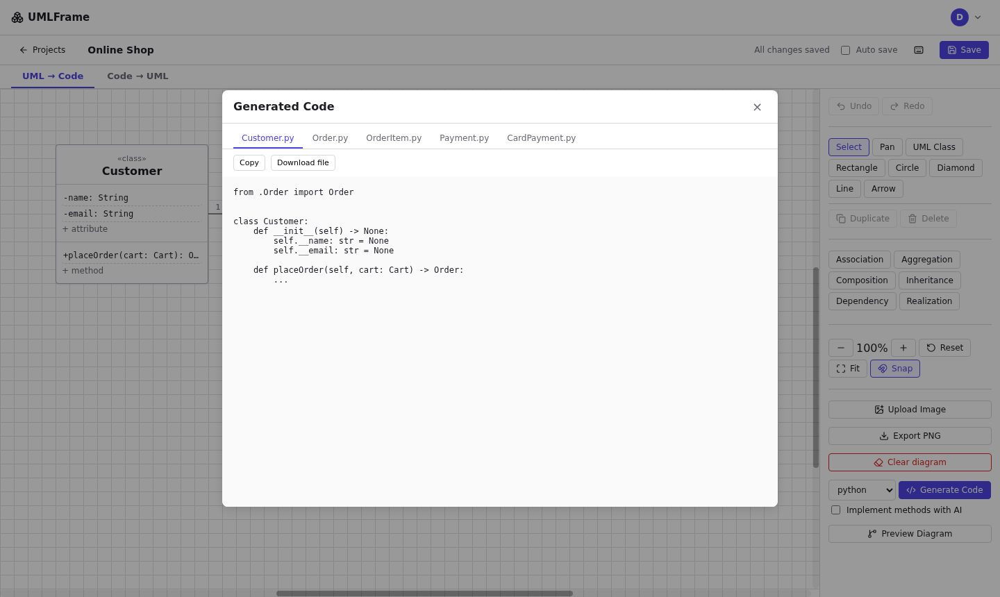
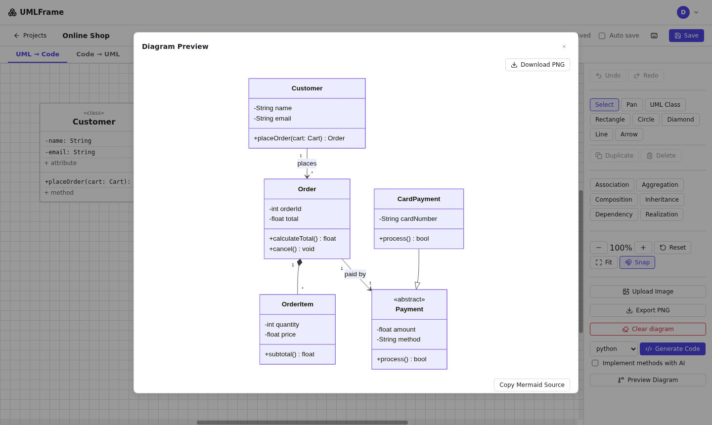
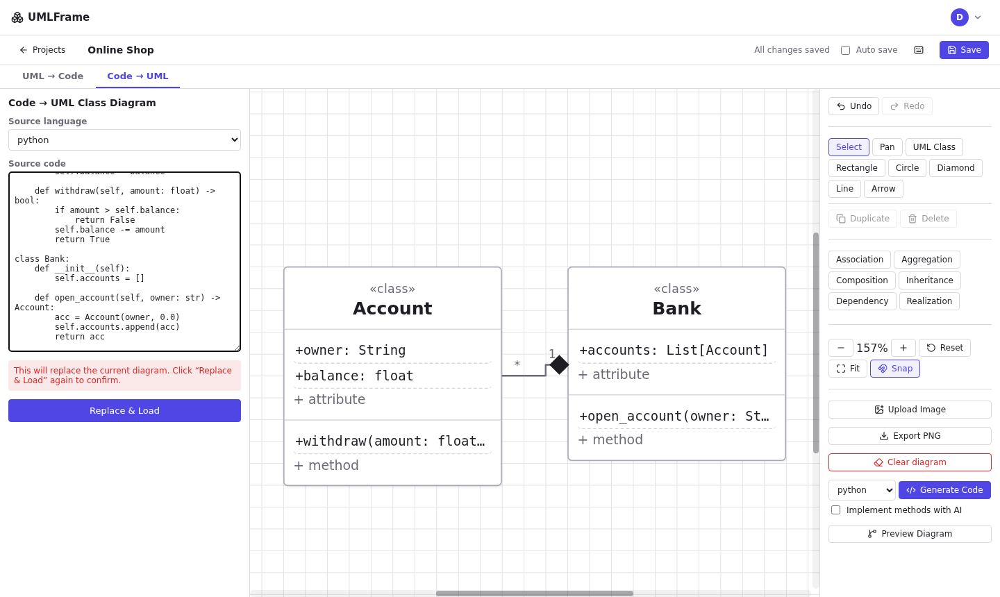
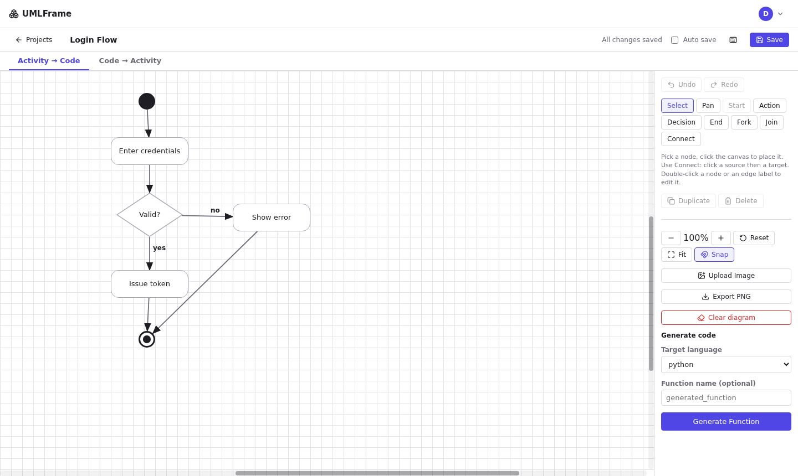
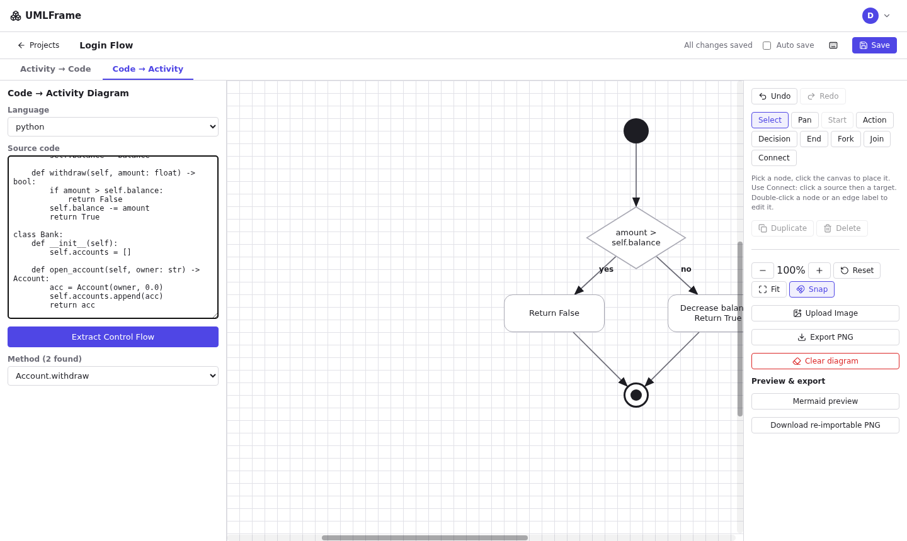

# UI Guide

## Dashboard

Projects are listed per type (UML class diagrams and activity diagrams). Search by name, sort by last updated or name, and delete with the trash icon.

## UML projects

Tabs: **UML → Code** and **Code → UML**.

1. Choose **UML Class** and click the canvas to add a class box. Click a row to expand it into edit fields.
2. Pick a relationship tool, then click the source class and the destination class.
3. Use Select to drag and resize, Pan or Ctrl/Cmd + scroll to move and zoom, Fit to frame everything.
4. Save with **Save** (Ctrl/Cmd + S) or tick **Auto save**.
5. Choose a language and press **Generate Code**.

**Preview Diagram** renders a Mermaid class diagram and can copy its source or download a PNG. **Upload Image** rebuilds a diagram from a PNG or JPEG.

### Code → UML

Paste source, choose the language and press **Parse & Load**.

## Activity projects

Tabs: **Activity → Code** and **Code → Activity**.

- Add Start, Action, Decision, End, Fork and Join nodes, then **Connect** them. Double-click to edit labels; write `yes` / `no` on edges leaving a decision.
- Every diagram needs one Start and at least one End.
- **Generate Function** produces the structured function for the chosen language.

### Code → Activity

Paste source, press **Extract Control Flow**, choose a method, then use **Mermaid preview** or **Download re-importable PNG**.

